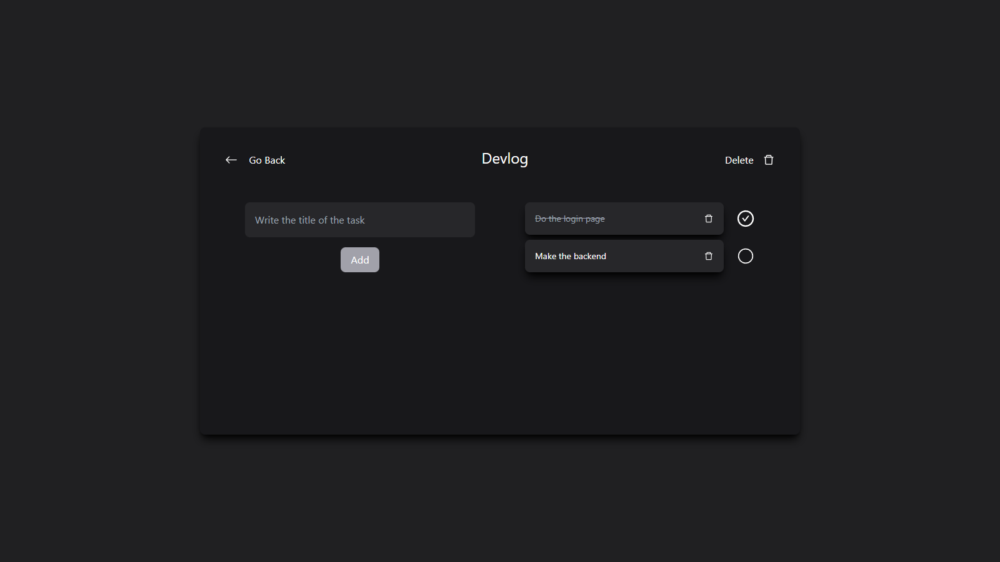

# Task Manager

## Description

A web application developed with React.js, Node.js, Express.js, Apollo-GrapQL and MongoDB. This web application makes easier the organization of your projects and tasks.

## Screenshots

## Features

-   Create, edit, update and delete projects
-   Create, edit and delete tasks
-   Assign tasks to projects
-   Manage the status of tasks

## Technologies

-   [React.js](https://reactjs.org/): A JavaScript library for building user interfaces.
-   [Node.js](https://nodejs.org/en/): A JavaScript runtime built on Chrome's V8 JavaScript engine.
-   [Express.js](https://expressjs.com/): A minimal and flexible Node.js web application framework.
-   [Apollo-GraphQL](https://www.apollographql.com/): A platform for building a data graph.
-   [MongoDB](https://www.mongodb.com/): A general purpose, document-based, distributed database built for modern application developers and for the cloud era.
